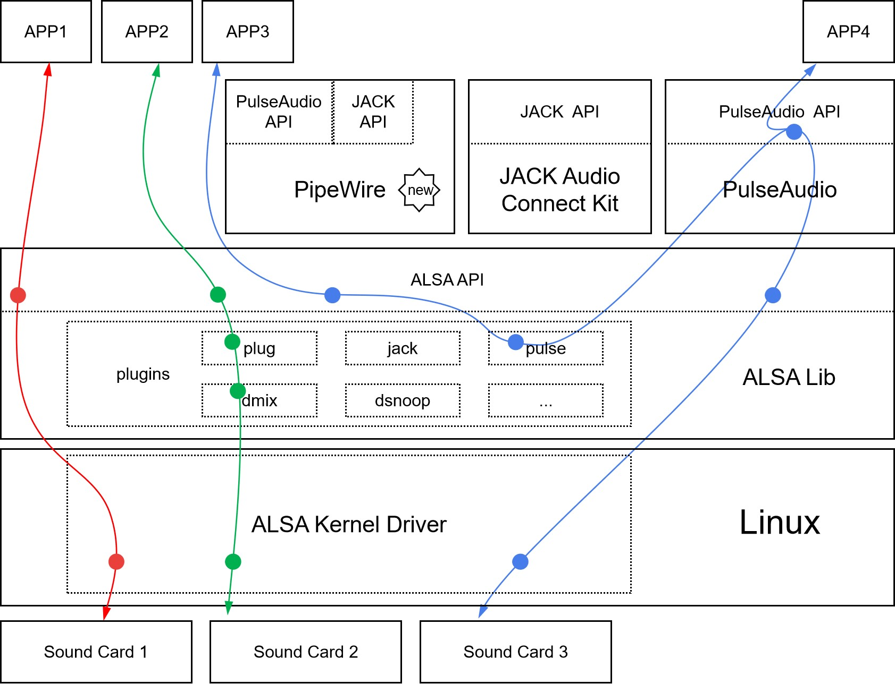

Audio on Linux
==============

To make a smart speaker, the first thing to do in terms of software is to learn how to record & play audio.
Most of smart speakers, except Apple's, are using Linux, so let's get started with audio on Linux.



We mainly focus on ALSA (Advanced Linux Sound Architecture) here. ALSA has two parts:
one is sound card drivers in Linux kernal which describes the audio hardware and provide a unified interface; 
the other is user-space ALSA library, which has a user friendly API (compare to ALSA kernel API), some utils and a plugin system. The plugin system has plugins such as `plug`, `dmix`, `dsnoop`, `pulse`, provides functions like resampling, mixing, channel mapping.
ALSA is not powerful enough, for example, we can use ALSA `dmix` plugin to support multiple applications using one sound card to play at the same time, but it's very limited, it's very hard to adjust each volume of each application.
So we have PulseAudio, which is a sound server to manage all the audio sources and sinks. It can handle not just ALSA audio, but also Bluetooth audio and network audio. When a USB sound card is plugged, PulseAudio will detect it and redirect playback to it (based on settings). Nowadays, PulseAudio is installed by default on most Linux desktop distributions. Similar to PulseAudio, we also have JACK and PipeWire. JACK mainly focuses on realtime, low-latency professional audio applications. [PipeWire is an ongoing project which aims to support the usecases currently handled by both PulseAudio and JACK and at the same time provide same level of powerful handling of Video input and output.](https://pipewire.org/)

When ALSA, PulseAudio and JACK all have their own APIs, what should we choose to use?
The short answer is ALSA API for most recording/playback applications, as PulseAudio and JACK both provide ALSA plugins to support applications through ALSA API. It's like APP3 in the above graph. [The author of PulseAudio, Lennart Poettering, alsa recommended a safe ALSA subset API to do basic PCM audio playback/capturing.](http://0pointer.de/blog/projects/guide-to-sound-apis.html)

So let's start to use ALSA to record & play audio.

### Record & Play Audio on Command Line
For raw audio or wav audio, we can just `aplay` and `arecord`. Actually, they are the same program with different names. You can run `ls -la /usr/bin/arecord` to find it out.  `aplay` and `arecord` have a bunch of parameters, but it is worth to learn these parameters (We will use these parameters in the code in a extremely simple way later). The best way to learn how to use `aplay` and `arecord` is to read the help of `aplay -h` or `man arecord` and practice:
```
$ aplay -h
Usage: aplay [OPTION]... [FILE]...

-h, --help              help
    --version           print current version
-l, --list-devices      list all soundcards and digital audio devices
-L, --list-pcms         list device names
-D, --device=NAME       select PCM by name
-q, --quiet             quiet mode
-t, --file-type TYPE    file type (voc, wav, raw or au)
-c, --channels=#        channels
-f, --format=FORMAT     sample format (case insensitive)
-r, --rate=#            sample rate
-d, --duration=#        interrupt after # seconds
-M, --mmap              mmap stream
-N, --nonblock          nonblocking mode
-F, --period-time=#     distance between interrupts is # microseconds
-B, --buffer-time=#     buffer duration is # microseconds
    --period-size=#     distance between interrupts is # frames
    --buffer-size=#     buffer duration is # frames
-A, --avail-min=#       min available space for wakeup is # microseconds
-R, --start-delay=#     delay for automatic PCM start is # microseconds 
                        (relative to buffer size if <= 0)
-T, --stop-delay=#      delay for automatic PCM stop is # microseconds from xrun
-v, --verbose           show PCM structure and setup (accumulative)
-V, --vumeter=TYPE      enable VU meter (TYPE: mono or stereo)
-I, --separate-channels one file for each channel
-i, --interactive       allow interactive operation from stdin
-m, --chmap=ch1,ch2,..  Give the channel map to override or follow
    --disable-resample  disable automatic rate resample
    --disable-channels  disable automatic channel conversions
    --disable-format    disable automatic format conversions
    --disable-softvol   disable software volume control (softvol)
    --test-position     test ring buffer position
    --test-coef=#       test coefficient for ring buffer position (default 8)
                        expression for validation is: coef * (buffer_size / 2)
    --test-nowait       do not wait for ring buffer - eats whole CPU
    --max-file-time=#   start another output file when the old file has recorded
                        for this many seconds
    --process-id-file   write the process ID here
    --use-strftime      apply the strftime facility to the output file name
    --dump-hw-params    dump hw_params of the device
    --fatal-errors      treat all errors as fatal
Recognized sample formats are: S8 U8 S16_LE S16_BE U16_LE U16_BE S24_LE S24_BE U24_LE U24_BE S32_LE S32_BE U32_LE U32_BE FLOAT_LE FLOAT_BE FLOAT64_LE FLOAT64_BE IEC958_SUBFRAME_LE IEC958_SUBFRAME_BE MU_LAW A_LAW IMA_ADPCM MPEG GSM SPECIAL S24_3LE S24_3BE U24_3LE U24_3BE S20_3LE S20_3BE U20_3LE U20_3BE S18_3LE S18_3BE U18_3LE U18_3BE G723_24 G723_24_1B G723_40 G723_40_1B DSD_U8 DSD_U16_LE DSD_U32_LE DSD_U16_BE DSD_U32_BE
Some of these may not be available on selected hardware
The available format shortcuts are:
-f cd (16 bit little endian, 44100, stereo)
-f cdr (16 bit big endian, 44100, stereo)
-f dat (16 bit little endian, 48000, stereo)
```
To record a 10 second, 48000Hz, 2 channels, S16_LE format audio:
```
arecord -d 10 -r 48000 -c 2 -f S16_LE audio.wav   # or arecord -d 10 -f dat audio.wav
```
When debug sound card, we want to check if there is any sound, we can use `-V mono` or `-V stereo` to show sound VU meter. To know the details of used plugins and settings, `-v` can be used. Or to loopback:
```
arecord -v -f dat - | aplay -v -Vstereo -
```
To choose PCM device, use `-D {name}`, use `aplay -L` to get a list of available PCM devices. PCM devices is different from sound cards. PCM devices can be created by ALSA plugins. When PulseAudio is installed, ALSA `pulse` plugin will create a PCM device named `pulse` which will be set as the default PCM device. ALSA plugins are stackable. For example, we can use `plug` and `dmix` together to run two recorder in two terminal:
```
arecord -v -D plug:dsnoop:0 -f dat -V stereo /dev/null
```
Use one sound card to play multiple audio:
```
aplay -v -D plug:dmix:0 music.wav
```
Next, we will use `aplay` and `arecord` in the code.

2. Record & Play Audio in the Code
The simplest way to get recording audio is: redirect `arecord` to `stdout` pipe，and then read audio from `stdout` pipe. In C code, it is:
```
#include <stdio.h>
int main(int argc, char **argv) {
    char *cmd = "arecord -D plughw:0 -f S16_LE -c 1 -r 16000 -t raw -q -";
    char buf[256];
    FILE *fp = popen(cmd, "r");

    for (int i=0; i<16; i++) {
        int result = fread(buf, 1, sizeof(buf), fp);
        printf("read %d bytes\n", result);

    }
    pclose(fp);
    return 0;
}
```
To play sound:
```
#include <stdio.h>
int main(int argc, char **argv) {
    char *cmd = "aplay -D plughw:0 -f S16_LE -c 1 -r 16000 -t raw -q -";
    char buf[256] = {0,};
    FILE *fp = popen(cmd, "r");

    for (int i=0; i<16; i++) {
        int result = fwrite(buf, 1, sizeof(buf), fp);
        printf("write %d bytes\n", result);

    }
    pclose(fp);
    return 0;
}
```

In Python code, it is quite simple too：
```
import subprocess
import audioop

cmd = ['arecord', '-D', 'plughw:0', '-f', 'S16_LE', '-c', '1', '-r', '16000', '-t', 'raw', '-q', '-']process = subprocess.Popen(cmd, stdout=subprocess.PIPE, shell=True)
for i in range(16):
    audio = process.stdout.read(160 * 2)
    print(audioop.rms(audio, 2))
process.stdout.close()
process.terminate()
```

We can also use ALSA API directly, but we learn to use varous of API to set parameters. It's a little hard touse. See [pcm.c to learn how to play a sine signal in different ways such as sync, async and poll.](https://www.alsa-project.org/alsa-doc/alsa-lib/_2test_2pcm_8c-example.html)

If you want cross-platform support, you may use PortAudio or [libsoundio](https://github.com/andrewrk/libsoundio). [There is a comparison between libsoundio and PortAudio](https://github.com/andrewrk/libsoundio/wiki/libsoundio-vs-PortAudio).
For python program, it seems libsoundio doesn't have a mature python binding, while PortAudio have pyaudio and [python-sounddevice](https://github.com/spatialaudio/python-sounddevice).
When using PortAudio (pyaudio or sounddevice), PortAudio will iterate all PCM devices and try to open them. There will be some error logs which is a little annoying.
Using pyaudio to record audio is simple, here is an example from [https://people.csail.mit.edu/hubert/pyaudio/](https://people.csail.mit.edu/hubert/pyaudio/)：

```
"""PyAudio example: Record a few seconds of audio and save to a WAVE file."""

import pyaudio
import wave

CHUNK = 1024
FORMAT = pyaudio.paInt16
CHANNELS = 2
RATE = 44100
RECORD_SECONDS = 5
WAVE_OUTPUT_FILENAME = "output.wav"

p = pyaudio.PyAudio()

stream = p.open(format=FORMAT,
                channels=CHANNELS,
                rate=RATE,
                input=True,
                frames_per_buffer=CHUNK)

print("* recording")

frames = []

for i in range(0, int(RATE / CHUNK * RECORD_SECONDS)):
    data = stream.read(CHUNK)
    frames.append(data)

print("* done recording")

stream.stop_stream()
stream.close()
p.terminate()

wf = wave.open(WAVE_OUTPUT_FILENAME, 'wb')
wf.setnchannels(CHANNELS)
wf.setsampwidth(p.get_sample_size(FORMAT))
wf.setframerate(RATE)
wf.writeframes(b''.join(frames))
wf.close()
```

IMHO, for simple audio recording/playback program, the best way is just using `aplay` and `arecord`. No extra dependencies is required, `stdin`/`stdout` pipe provides a buffer mechanism and it's stable and multi-process (A++ for multi-core ARM processor).
